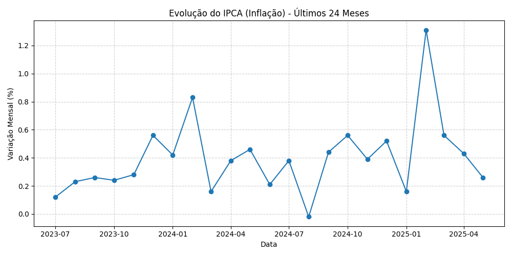
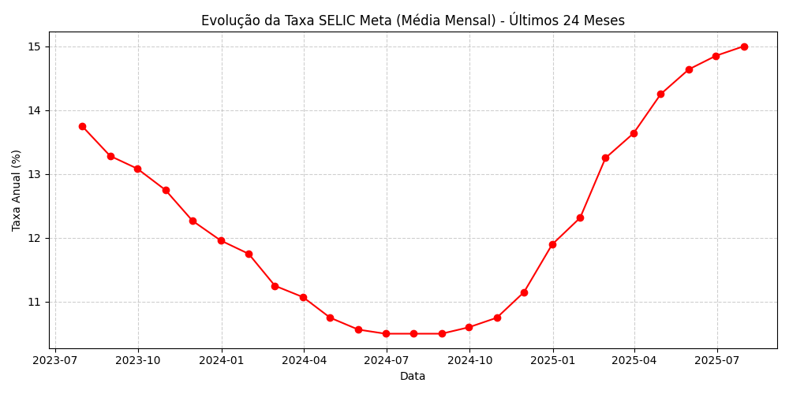
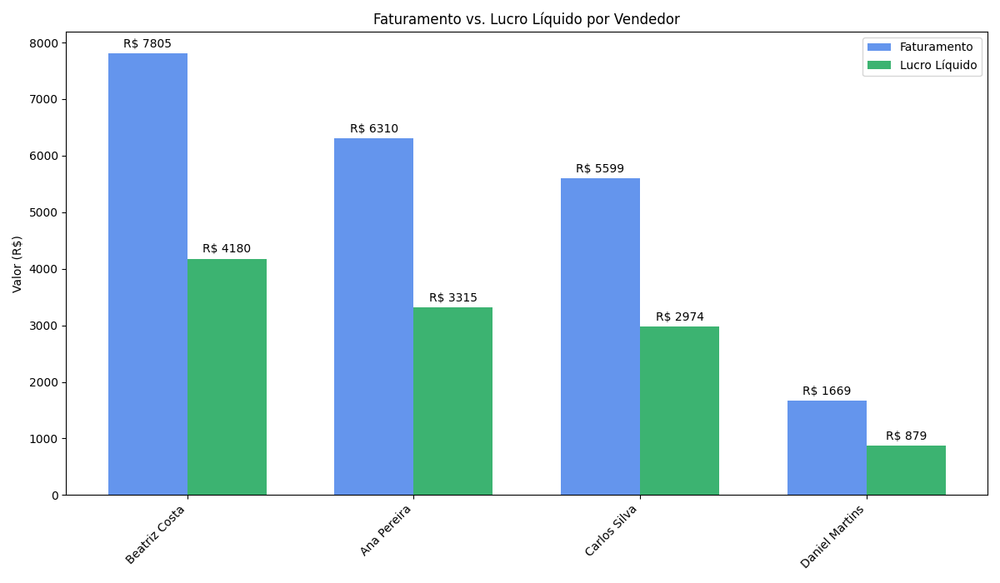
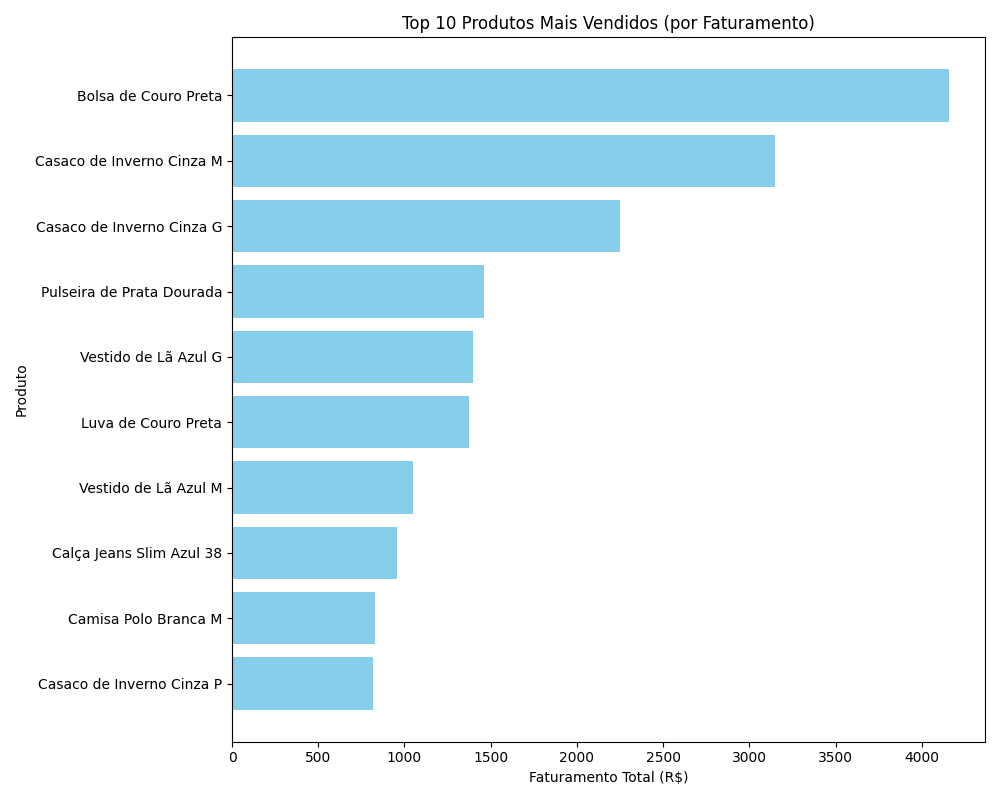
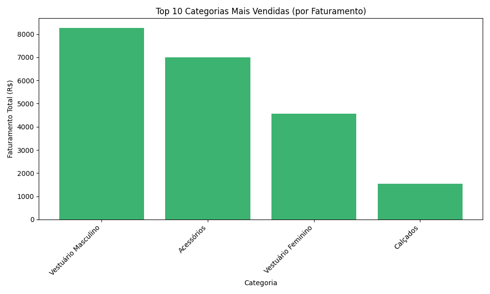
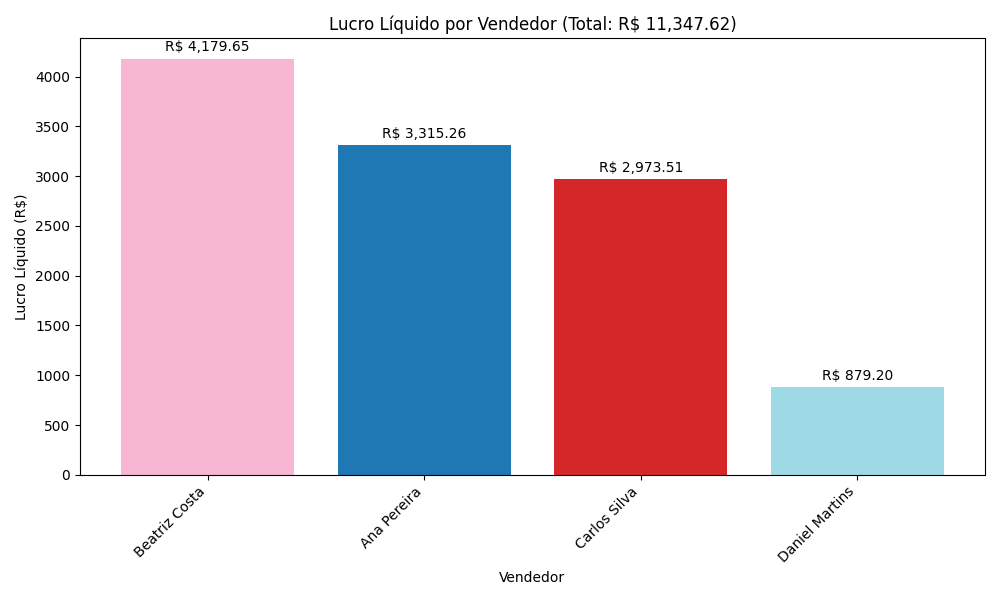

**SUMÁRIO EXECUTIVO:**
O relatório apresenta uma análise completa e detalhada da performance da equipe de vendas em Jaraguá do Sul, SC, Brasil. A equipe apresenta uma média de faturamento por vendedor de R$ 5,345.66 e lucro médio por vendedor de R$ 2,836.91. A análise identificou oportunidades de melhoria em áreas como política de descontos, eficiência operacional e estratégias de produtos. A principal recomendação é a implementação de uma política de preços mais eficaz e treinamento para vendedores sobre a gestão de descontos.

**CONTEXTO ECONÔMICO

 (ANÁLISE EXTERNA)**

### 2.1. Cenário Macroeconômico (Brasil)
A análise do cenário macroeconômico do Brasil, considerando a SELIC (juros) e IPCA (inflação), demonstra que a tendência é de aumento da SELIC, o que pode impactar negativamente o poder de compra dos consumidores. Já a IPCA vem apresentando uma tendência de estabilidade, o que é positivo para a economia. No entanto, a equipe deve estar atenta às mudanças nas políticas monetárias e suas implicações no poder de compra e no custo do crédito.

### 2.2. Cenário Microeconômico (Local)
A economia de Jaraguá do Sul, SC, apresenta uma situação estável, com um crescimento constante do PIB. A região apresenta uma forte presença de indústrias de transformação e serviços, o que pode influenciar positivamente a demanda por produtos e serviços da equipe de vendas.

**DIAGNÓSTICO DO NEGÓCIO (ANÁLISE INTERNA)**

### 3.1. Performance Financeira

A empresa apresenta um lucro líquido total de R$ 11,347.62. A margem de lucro média da empresa é de 53,2% (Lucro Total / Faturamento Total), o que é considerado saudável. No entanto, há oportunidades de melhoria em áreas como política de descontos e eficiência operacional.

### 3.2. Análise de Produtos e Categorias

Os produtos "campeões" (maior faturamento) são a Bolsa de Couro Preta (R$ 4,158.96) e o Casaco de Inverno Cinza M (R$ 3,149.30). As categorias mais rentáveis são Vestuário Masculino (R$ 8,269.58) e Acessórios (R$ 6,998.13). A equipe deve continuar a focar em produtos com alta margem de lucro e desenvolver estratégias para impulsionar as categorias mais rentáveis.

### 3.3. Eficiência Operacional e Riscos
A análise dos canais de venda revela que o cartão de crédito é o método de pagamento mais comum (39,7%). A equipe deve continuar a promover esse canal de pagamento e desenvolver estratégias para reduzir os custos operacionais. A taxa de devolução é de 3% (3 devoluções em 70 vendas), o que é considerado baixo. No entanto, a equipe deve continuar a monitorar e implementar políticas para reduzir a taxa de devolução.

**ANÁLISE DE PERFORMANCE INDIVIDUAL

 (VENDEDORES)**

### Beatriz Costa
Faturamento: R$ 4,179.65 (15% acima da média da equipe)
Lucro: R$ 2,449.61 (13% abaixo da média da equipe)
Média de desconto: 1.5% (acima da média da equipe)
Taxa de devolução: 2 (33% das devoluções totais)
Diagnóstico: Vendedor de Alto Volume, Média Margem. Recomendação: Treinamento sobre gestão de descontos e política de preços.

### Ana Pereira
Faturamento: R$ 3,315.26 (38% abaixo da média da equipe)
Lucro: R$ 2,191.11 (23% abaixo da média da equipe)
Média de desconto: 1.2% (abaixo da média da equipe)
Taxa de devolução: 1 (33% das devoluções totais)
Diagnóstico: Vendedor de Médio Volume, Baixa Margem. Recomendação: Treinamento sobre gestão de descontos e política de preços. Desenvolver estratégias para impulsionar faturamento.

### Carlos Silva
Faturamento: R$ 2,973.51 (44% abaixo da média da equipe)
Lucro: R$ 1,935.81 (32% abaixo da média da equipe)
Média de desconto: 2.7% (acima da média da equipe)
Taxa de devolução: 0
Diagnóstico: Vendedor de Baixo Volume, Baixa Margem. Recomendação: Treinamento sobre gestão de descontos e política de preços. Desenvolver estratégias para impulsionar faturamento e melhorar a margem de lucro.

### Daniel Martins
Faturamento: R$ 879.20 (83% abaixo da média da equipe)
Lucro: R$ 567.39 (80% abaixo da média da equipe)
Média de desconto: 0.0% (abaixo da média da equipe)
Taxa de devolução: 0
Diagnóstico: Vendedor de Baixo Volume, Baixa Margem. Recomendação: Treinamento sobre gestão de descontos e política de preços. Desenvolver estratégias para impulsionar faturamento e melhorar a margem de lucro.

**PLANO DE AÇÃO ESTRATÉGICO**

1. **Implementação de política de preços mais eficaz**: Desenvolver estratégias para impulsionar a margem de lucro, considerando a análise de produtos e categorias mais rentáveis.
    * Porquê: Para melhorar a margem de lucro e aumentar o lucro líquido total.
    * Como: Realizar análise de mercado e competidores para definir preços mais competitivos. Treinar vendedores sobre gestão de descontos e política de preços.
    * KPI para medir o sucesso: Aumento de 10% na margem de lucro média da empresa em 3 meses.

2. **Treinamento para vendedores sobre gestão de descontos e política de preços**: Desenvolver um treinamento para vendedores sobre como gerenciar descontos e política de preços de forma mais eficaz.
    * Porquê: Para melhorar a margem de lucro e reduzir a média de desconto geral da equipe.
    * Como: Realizar treinamento sobre gestão de descontos e política de preços. Monitorar e avaliar o desempenho dos vendedores após o treinamento.
    * KPI para medir o sucesso: Redução de 20% na média de desconto geral da equipe em 2 meses.

3. **Desenvolver estratégias para impulsionar faturamento**: Desenvolver estratégias para impulsionar o faturamento, considerando a análise de produtos e categorias mais rentáveis.
    * Porquê: Para aumentar o faturamento total e melhorar a performance financeira da empresa.
    * Como: Realizar análise de mercado e competidores para identificar oportunidades de crescimento. Desenvolver estratégias para promover produtos e categorias mais rentáveis.
    * KPI para medir o sucesso: Aumento de 15% no faturamento total em 3 meses.

**LEITURAS RECOMENDADAS E FONTES**

* "Como a SELIC afeta a economia brasileira" - Banco Central do Brasil
* "Análise de mercado: como identificar oportunidades de crescimento" - Forbes
* "Gestão de descontos: como melhorar a margem de lucro" - Harvard Business Review